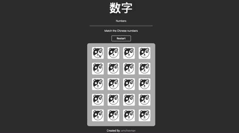
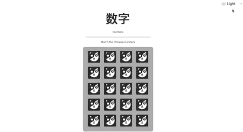

        
 

<h1 align="center">Chinese Numbers Memory Game</h1>

## 📝 Summary

A Chinese number memory game made from Javascript is a game that challenges the player to match pairs of Chinese number characters displayed on cards. The player must flip over two cards at a time to find a matching pair. The game keeps track of how many matching pairs have been found and alerts the player when all pairs have been matched. The game also shuffles the cards randomly each time it is played to provide a new challenge for the player.

        

### 🛠 Technologies
Project was created with:

- HTML5
- CSS3
- JavaScript
- Affinity Designer

### 🖍 Features
- Custom card icons made by amchatman
- Three themes Dark,Light, and New Year. (Default theme is base on device theme settings)

        

### 😓Issues
- Congratulation sometimes pop up too early
- Cards unmatch even when a match is found (Mobile Only)
- Card sometime flip back over on second click

### 📈Latest Update
- Added a restart button (3/11/2023)
- Update and create customize alert (3/31/2023)
